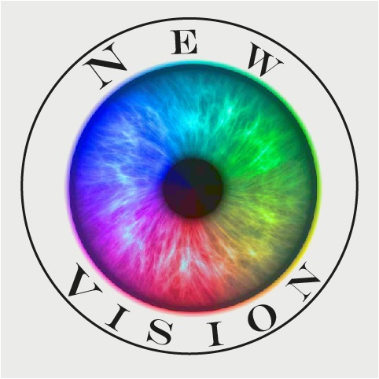
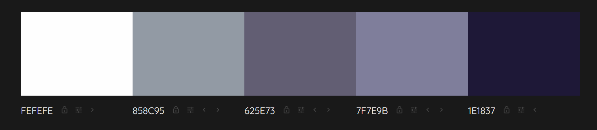
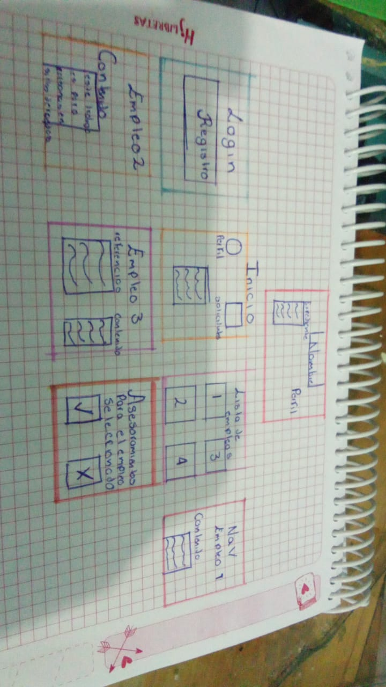

# NEW VISION

 |  | 
--------------------------------------------|-------------------------------------------|
 Logo de la empresa | Logo del proyecto |

## Proyecto integrador

Se pretende crear una aplicacion web en la cual, los usuarios de la misma permitira a estos poder buscar, aplicar y obtener distintas ofertas de trabajo en base a las capacidades actuales que posee el usuario, cada usuario puede crear un perfil que permita mostrar sus distintas habilidades, asi como tambien las empresas podran publicitar convocatorias para poder obtener los mejores candidatos para aplicar a ellas

## Problematica

Las personas con capacidades diferentes enfrentan múltiples desafíos al buscar empleo. Estos incluyen discriminación, barreras físicas y actitudinales, menos oportunidades laborales, salarios más bajos y riesgos psicosociales. La inclusión y la sensibilización son clave para superar estas dificultades y lograr igualdad de oportunidades en el mercado laboral.

## Propuesta de solución

Nuestra propuesta es desarrollar la aplicación NEW VISION que tiene como objetivo facilitar la integración de personas con discapacidad al mercado laboral. A través de esta plataforma, agencias de empleo, empresas y candidatos pueden colaborar para eliminar estas barreras y mitigar las dificultades que enfrentan las personas con capacidades diferentes a la hora de buscar empleo.

## Objetivo General:

Este proyecto tiene como objetivo principal brindar seguimiento y oportunidades laborales a personas con capacidades diferentes. A través de un sistema de soporte, buscamos facilitar su reintegración en el ámbito laboral, asegurando que puedan desempeñarse como elementos valiosos y funcionales en sus trabajos. De esta manera, no solo se les proporciona una opcion viable para poder obtener empleo, si no que, facilita el contacto con diferentes empresas publicitando sus propias habilidades

## Objetivos Especificos: 
  - Crear una estructura que permita a las personas con capacidades diferentes obtener o su primer empleo o un nuevo empleo en caso de falta de oportunidades debido a sus capacidades actuales.
  - Diseñar una plataforma de soporte que de información de empresas y de solicitantes en base a un curriculum que las empresas puedan observar desde la plataforma para así poder volver más eficiente el proceso de contratación en base a los requerimientos que busque la empresa.
  - Establecer una aplicación para que los usuarios puedan hacer mas facil el publicitar las habilidades propias del usuario
  - Diseñar un sistema de soporte que permita crear o modificar el diseño de un perfil exclusivo para cada usuario.
  - Dar seguimiento en base a sus curriculum con ayuda de un algoritmo que sugiera los tipos de empleo a los que puede aplicar.
  - Crear elementos visuales distintivos para que el usuario pueda tener un perfil en el que se muestren distintos elementos o tags que las empresas puedan filtrar para así optimizar la busqueda de candidatos y poder enviar recomendaciones para entrevistarlos.
  - Saber los distintos empleos en los que el usuario ha trabajado, es decir se puede llevar un historial y experiencia laboral.
  - Establecer un sistema de seguridad en el cual el usuario pueda resguardar la confidencialidad de sus documentos de manera que estos no puedan ser accedidos por un tercero, esto será realizado mediante una encriptación para estos.
  - Mostrar en su perfil el seguimiento de revisión de documentos por parte empresas para que estas puedan mostrar su interés por un usuario mediante un sistema de visitas
  - Dar contacto de empresas a usuarios para poder recaudar de manera mas directa candidatos aplicantes a las distintas ofertas de trabajo emitidas, para ello se establece un campo de contacto donde la empresas puede dejar datos de contacto

## Diagrama de Gantt

## Colaboradores

[@AbishaiFC](https://github.com/AbishaiFC) | [@CarlosFosadoo](https:github.com/CarlosFosadoo) | [@ArtQuir29](https://github.com/ArtQuir29)
------|-------|------|
Lider de Database | Lider de Documentación | Lider de FrontEnd y BackEnd

## Organigrama

## Lista de Tecnologías

Los programas que tenemos previstos para usar son: 

  - **Cliente:**

         

  - **Servidor:**
  
     

  - **Pruebas:**

   

  - **Documentación:**

<<<<<<< HEAD

## Objetivo General:

Se busca dar seguimiento o la primera oportunidad a casos de desempleo de personas con capacidades diferentes, para que, este proyecto funcione como un sistema de soporte y apoyo para que estas personas puedan ser reintegradas como elementos funcionales en un trabajo que les de remuneración para que estos puedan vivir en condiciones con una buena calidad de vida

## Objetivos Especificos: 
  - Se busca conseguir un mayor alcance de difusión para crear una estructura que permita a las personas con capacidades diferentes obtener o su primer empleo o un nuevo empleo en caso de falta de oportunidades debido a sus capacidades actuales
  - Se pretende crear una plataforma de soporte que de información de empresas y de solicitantes en base a un curriculum que las empresas puedan observar desde la plataforma para así poder volver más eficiente el proceso de contratación en base a los requerimientos que busque la empresa
  - Se pretende crear una aplicación para que los usuarios que requieren del sistema puedan acceder a material que permita potenciar sus habilidades o desarrollar nuevas sin ningún costo adicional
  - Se pretende el diseño de un perfil exclusivo para cada usuario en base a sus curriculum en base a un algoritmo que sugiera los tipos de empleo a las que puede capacitarse para obtener el empleo
  - Se promueve que el usuario pueda tener un perfil en el que se muestren distintos elementos o tags que las empresas puedan filtrar para así filtrar candidatos y poder enviar alguna recomendación para entrevista a estos
  - La aplicación podrá saber a los distintos empleos a lo que el usuario ha trabajado, es decir se puede llevar un historial y experiencia laboral registrados
  - Se podrá contar con un sistema de seguridad en el cual el usuario pueda resguardar la confidencialidad de sus documentos de manera que estos no puedan ser accedidos por un tercero, esto será realizado mediante una encriptación para estos
  - Se pretende que la aplicación en un futuro estos puedan tener un certificado brindado por la aplicación que de fe y legalidad sobre la documentación emitida en la misma.
  - Los usuarios podrán ver en su perfil el seguimiento de revisión de documentos por parte empresas para que estas puedan mostrar su interés por un usuario mediante un sistema de visitas
  - La aplicación podrá contar con un sistema de asesorías en las que se les brinde coordinación y experiencia para poder aplicar a diversas entrevistas de manera exitosa

## Identidad grafica
<li>Logo de la empresa</li>

<li>Logo del proyecto</li>

<li>Paleta de colores para el proyecto</li>

<li>prototipo de pagina</li>

## Requerimientos Funcionales
1. Registro de usuarios 
2. Búsqueda avanzada de ofertas de trabajo por ubicación.
3. Filtros de búsqueda por tipo de trabajo
4. Filtros de búsqueda por salario
5. Filtros de búsqueda por horario
6. Creación de perfiles profesionales.
7.Edicion de perfiles profesionales
8. Notificaciones de nuevas ofertas de trabajo.
9. Integración con redes sociales para compartir ofertas.
10. Posibilidad de aplicar a las ofertas directamente desde la app.
11. Seguimiento del estado de las entrevistas realizadas.
12. Mensajería interna para comunicación entre empleadores y solicitantes.
13. Calendario para programar entrevistas y/o eventos relacionados con el empleo.
14. Recomendaciones de trabajo sobre las búsquedas realizadas
15. Herramientas para la creación de currículums.
16.Herramientas para la edición de curriculums.
17. Generación de informes y estadísticas sobre el uso de la aplicación.
18. Opción de guardar ofertas de trabajo para revisarlas más tarde.
19. Integración con servicios de mapas para visualizar la ubicación de las empresas.
20. Alertas/notificaciones sobre plazos de aplicación y fechas límite para ofertas de trabajo.
21. Herramientas para preparar entrevistas, como preguntas frecuentes y simulacros. (apartado de FAQ)
22. Foros o comunidades para que los usuarios compartan experiencias y consejos o detalles acerca de las entrevistas realizadas.
23. Se guardaran las entrevistas o trabajos visitados para que sean más fáciles de sugerir.
24. Capacidades de geolocalización para encontrar oportunidades cercanas.
25. Acceso a programas de capacitación laboral y pasantías.
26. Opción de ingreso personalizado dependiendo del tipo de discapacidad que indique el usuario
27. Soporte para que las empresas puedan marcar en la aplicación ciertos candidatos
28. Opción para que la empresa pueda mandar una notificación a los usuarios en base a los resultados de cada entrevista
29. La empresa podrá ser capaz de establece una convocatoria de entrevista mediante la app
30. Las empresas podrán crear un usuario personalizado con un distintivo
31. Elementos distintivos entre usuarios y empresas
32. Las empresas podrán detallar en su perfil una descripción del trabajo y al tipo de usuarios que va dirigido (es decir, que usuarios con capacidades diferentes es a la que está orientada)
33. Los usuarios podrán tener la opción de marcar empresas como fraudulentas 
34. Cada interfaz dependiendo de la capacidad diferente con la que cuente el usuario será especializada o enfocada en este.

## Requerimientos no funcionales
<ol>
<li>Seguridad: La aplicación debe cumplir con los estándares de seguridad de la industria para proteger la información personal y sensible de los usuarios.</li>
<li>Usabilidad: La interfaz de usuario debe ser intuitiva y fácil de usar, incluso para personas con poca experiencia en tecnología</li>
<li>Rendimiento: La aplicación debe ser ágil y responder rápidamente a las solicitudes del usuario, incluso en condiciones de alta carga./li>
<li>Fiabilidad: La aplicación debe ser estable y confiable, minimizando el riesgo de fallos o caídas inesperadas.</li>
<li>Escalabilidad: La aplicación debe ser capaz de manejar un crecimiento en el número de usuarios sin sacrificar su rendimiento.</li>
<li>Compatibilidad: La aplicación debe ser compatible con una amplia gama de dispositivos móviles y sistemas operativos.</li>
<li>Accesibilidad: La aplicación debe cumplir con los estándares de accesibilidad para garantizar que sea utilizada por personas con discapacidades.</li>
<li>Mantenibilidad: El código y la infraestructura de la aplicación deben ser fáciles de mantener y actualizar.</li>
<li>Disponibilidad: La aplicación debe estar disponible para su uso en la mayoría del tiempo, con tiempos mínimos de inactividad programada.</li>
<li>Localización: La aplicación debe poder adaptarse a diferentes idiomas y regiones, permitiendo a los usuarios acceder a ofertas de trabajo locales</li>
<li>Cumplimiento normativo: La aplicación debe cumplir con las regulaciones y leyes laborales y de privacidad aplicables en las regiones donde se utilice.</li>
<li>Tolerancia a fallos: La aplicación debe ser capaz de manejar errores de forma elegante, minimizando el impacto en la experiencia del usuario.</li>
<li>Consumo de recursos: La aplicación debe utilizar eficientemente los recursos del dispositivo, como la batería y el almacenamiento. </li>
<li>Interoperabilidad: La aplicación debe ser capaz de integrarse con otros sistemas y servicios relacionados con el empleo, como bases de datos de empresas o servicios gubernamentales.</li>
<li>Estabilidad: La aplicación no debe presentar comportamientos inesperados o inestables durante el uso normal.</li>
<li>Privacidad: La aplicación debe proteger la privacidad de los usuarios y cumplir con las regulaciones de protección de datos.</li>
<li>Internacionalización: La aplicación debe ser diseñada teniendo en cuenta las diferencias culturales y regionales para adaptarse a diversas audiencias.</li>
<li>Tiempo de respuesta: La aplicación debe responder a las interacciones del usuario dentro de un tiempo razonable, evitando tiempos de espera excesivos.</li>
<li>Ancho de banda: La aplicación debe minimizar el consumo de ancho de banda, especialmente para usuarios con conexiones lentas o limitadas.</li>
<li>Documentación: La aplicación debe contar con documentación completa y actualizada para facilitar su uso y mantenimiento por parte del equipo técnico.</li>
<li>Estética visual: La interfaz y el diseño de la aplicación deben ser atractivos y coherentes para brindar una experiencia agradable al usuario.</li>
<li>Adaptabilidad: La aplicación debe ser capaz de adaptarse a diferentes tamaños y resoluciones de pantalla sin comprometer la usabilidad.</li>
<li>Seguridad contra ataques cibernéticos: La aplicación debe contar con medidas robustas para protegerse contra ataques como phishing, malware o ingeniería social.</li>
<li>Costo: El desarrollo y mantenimiento de la aplicación deben realizarse dentro de un marco presupuestario definido.</li>
<li>Integración con redes sociales: La aplicación debe permitir a los usuarios compartir contenido en redes sociales populares para ampliar su alcance.</li>
<li>Eficiencia energética: La aplicación debe optimizar el consumo energético para maximizar la duración de la batería en dispositivos móviles.</li>
<li>Cumplimiento con estándares móviles: La aplicación móvil debe seguir las pautas y estándares recomendados por las plataformas iOS y Android.</li>
<li>Pruebas exhaustivas: La aplicación debe someterse a pruebas rigurosas para garantizar su calidad y fiabilidad antes del lanzamiento oficial.</li>
<li>Respaldo y recuperación de datos: La aplicación debe contar con sistemas eficaces para realizar copias de seguridad regulares y facilitar la recuperación en caso de pérdida o corrupción de datos</li>
</ol>

## Autores

[@AbishaiFC](https://github.com/AbishaiFC) 
[@CarlosFosadoo](https:github.com/CarlosFosadoo)
[@ArtQuir29](https://github.com/ArtQuir29)

## Licencia de Software

=======
  
>>>>>>> f44ea8d9ba219b65ae9d4e9bbdfde246f519d22f
